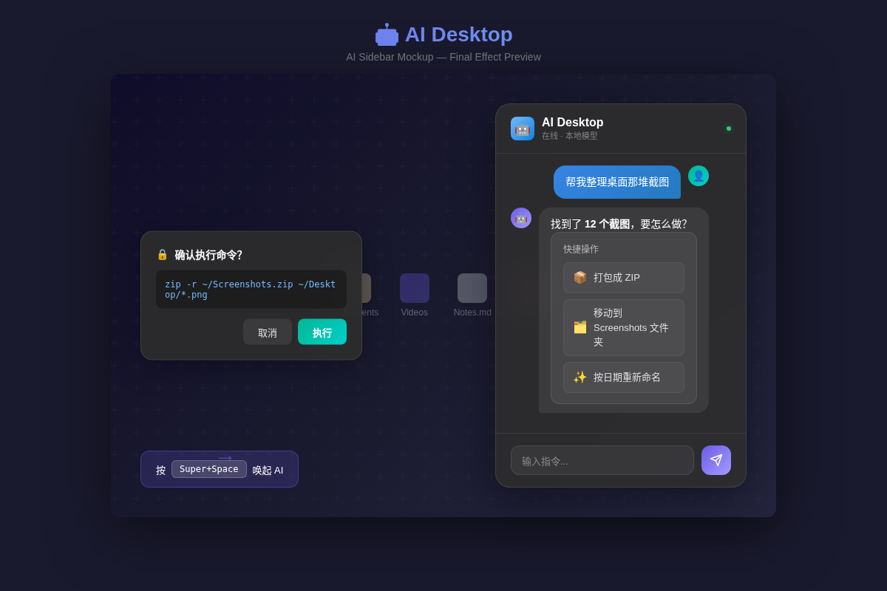

# 🤖 AI Desktop

> Linux 桌面 AI 化 — 用对话代替点击，专注效率，零冗余。

一个轻量级的 AI 原生 Linux 桌面外壳。通过侧边栏对话窗口，用自然语言控制桌面，而不是在菜单和窗口之间反复寻找、点击。

<div align="center">


</div>

<div align="center">



</div>

## 💡 为什么

现在的 Linux 桌面用了二十年了，操作模式没变。我想做的事——浏览器、文件管理器、终端、设置——每个都要走好几层菜单才能找到。

AI Desktop 想改变它：

> 你只需要说："帮我整理桌面那堆截图"、"打开浏览器找几个文件"。

通过对话，而不是点击，找到你要的东西。

## ✨ 核心功能

- **AI Sidebar** — 浮动在桌面旁边的 AI 侧边栏，随时打开对话窗口
- **Chat-First 操作** — "打开浏览器"、"找到照片"、"整理文件"
- **本地优先** — 通过 llama.cpp 本地 API，默认端口 8080，数据不离开本机
- **全局快捷键** — `Super+Space` 一键唤起，任何状态下可用
- **沙箱执行** — 敏感操作有安全沙箱，不会乱动系统
- **跨桌面兼容** — GNOME、KDE、XFCE、Wayland、X11

## 🏗️ 技术栈

| 层 | 技术 | 说明 |
|---|------|------|
| **框架** | Tauri v2 | Rust 后端 + Web 前端，轻量 |
| **前端** | React + TypeScript + TailwindCSS | 组件化 UI |
| **后端** | Rust (tokio) | 系统调用安全高效 |
| **IPC** | Tauri Commands | 前后端无延迟通信 |
| **AI** | llama.cpp API (本地) | HTTP 本地 API 交互 |
| **状态管理** | Zustand | 轻量全局状态管理 |

## 🚀 快速开始

```bash
# 1. clone 下来
git clone https://github.com/linyize/ai-desktop.git
cd ai-desktop

# 2. 安装依赖
cargo install tauri-cli --version "^2"
npm install

# 3. 启动 llama.cpp 本地服务（如果没有的话）
~/llm-server.sh 35b

# 4. 运行 AI Desktop
cargo tauri dev
```

## ⚙️ 配置

项目配置文件在：

```bash
# 默认配置
config/default/

# 用户个人配置（不会被覆盖）
~/.config/ai-desktop/
```

可配置项：

- `ai.apiUrl` — llama.cpp 服务端地址（`http://localhost:8080`）
- `hotkey.trigger` — 全局快捷键（`Super+Space`）
- `sidebar.position` — 侧边栏位置（`right`）
- `sandbox.enabled` — 沙箱模式开关（`true`）

## 📐 项目结构

```
ai-desktop/
├── src/                     # 源代码
│   ├── backend/             # Rust 后端
│   │   ├── main.rs          # 入口
│   │   ├── sidebar.rs       # 侧边栏逻辑
│   │   ├── hotkey.rs        # 快捷键事件处理器
│   │   ├── ai.rs            # llama.cpp API 通信
│   │   └── native.rs        # 原生系统调用
│   └── ui/                  # React 前端
│       ├── src/
│       │   ├── App.tsx      # 组件架
│       │   └── main.tsx     # 渲染入口
│       ├── components/      # React 组件
│       └── lib/             # 工具函数
├── config/                  # 配置文件
│   ├── default/             # 默认配置
│   ├── user/                # 用户配置（git 忽略）
│   └── runtime/             # 运行时生成
├── scripts/                 # 构建/发布脚本
├── tests/                   # 测试
└── docs/                    # 文档
```

## 🔮 Roadmap

| 阶段 | 任务 | 状态 |
|:--|:--|:-:|
| **Phase 1** | 项目骨架、CI/CD | ✅ 完成 |
|  | AI 侧边栏 UI | 🚧 进行中 |
|  | 状态管理 | 🔲 待做 |
|  | llama.cpp 集成 | 🔲 待做 |
| **Phase 2** | 全局快捷键 | 🔲 待做 |
|  | 系统调用层 | 🔲 待做 |
|  | 沙箱执行系统 | 🔲 待做 |
|  | 通知系统集成 | 🔲 待做 |
| **Phase 3** | 打包发布 | 🔲 待做 |

## 🛠️ 开发

### 环境要求

- Rust >= 1.70
- NodeJS >= 18
- Tauri CLI `^2`

```bash
# 开发模式
cargo tauri dev

# 构建发布版本
cargo tauri build

# 运行测试
cargo test
npm test
```

### 代码风格

- Rust: `cargo fmt` + `cargo clippy`
- Frontend: `npm run lint` + `npm run format`

## 📄 License

AGPL-3.0 License — [查看详情](./LICENSE)
